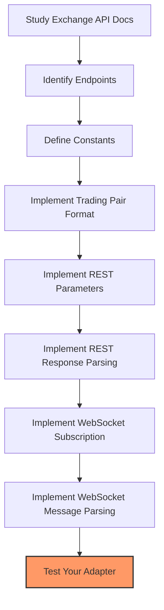

# Adapter Implementation Guide

This guide walks you through the process of implementing an adapter for a new exchange.

## Step 1: Set Up Directory Structure

First, create the necessary directory structure:

```bash
mkdir -p candles_feed/adapters/your_exchange_name
```

## Step 2: Create Constants File

Create a constants file to define exchange-specific values:

```python
# candles_feed/adapters/your_exchange_name/constants.py

from typing import Dict

# API URLs
REST_URL = "https://api.your-exchange.com"
WSS_URL = "wss://ws.your-exchange.com"

# API endpoints
CANDLES_ENDPOINT = "/api/v1/klines"
SERVER_TIME_ENDPOINT = "/api/v1/time"

# API rate limits
MAX_RESULTS_PER_CANDLESTICK_REST_REQUEST = 1000

# Intervals mapping: interval name -> seconds
INTERVALS: Dict[str, int] = {
    "1m": 60,
    "5m": 300,
    "15m": 900,
    "1h": 3600,
    "4h": 14400,
    "1d": 86400,
    "1w": 604800
}

# Exchange-specific interval formats (if needed)
INTERVAL_TO_EXCHANGE_FORMAT = {
    "1m": "1min",
    "5m": "5min",
    "15m": "15min",
    "1h": "1hour",
    "4h": "4hour",
    "1d": "1day",
    "1w": "1week"
}

# Websocket supported intervals
WS_INTERVALS = ["1m", "5m", "15m", "1h"]  # Not all exchanges support all intervals via WebSocket
```

## Step 3: Implement the Adapter Class

Create the adapter class that inherits from `BaseAdapter`:

```python
# candles_feed/adapters/your_exchange_name/your_exchange_adapter.py

from typing import Dict, List, Optional

from candles_feed.adapters.base_adapter import BaseAdapter
from candles_feed.adapters.your_exchange_name.constants import (
    INTERVALS, REST_URL, WSS_URL, WS_INTERVALS, CANDLES_ENDPOINT,
    MAX_RESULTS_PER_CANDLESTICK_REST_REQUEST, INTERVAL_TO_EXCHANGE_FORMAT
)
from candles_feed.core.candle_data import CandleData
from candles_feed.core.exchange_registry import ExchangeRegistry


@ExchangeRegistry.register("your_exchange_name")
class YourExchangeAdapter(BaseAdapter):
    """Your exchange adapter implementation."""
    
    def get_trading_pair_format(self, trading_pair: str) -> str:
        """Convert standard trading pair format to exchange format.
        
        Args:
            trading_pair: Trading pair in standard format (e.g., "BTC-USDT")
            
        Returns:
            Trading pair in exchange format
        """
        # Implement exchange-specific trading pair formatting
        # For example, some exchanges use format like "BTCUSDT" without hyphen
        return trading_pair.replace("-", "")
    
    def get_rest_url(self) -> str:
        """Get REST API URL for candles.
        
        Returns:
            REST API URL
        """
        return f"{REST_URL}{CANDLES_ENDPOINT}"
    
    def get_ws_url(self) -> str:
        """Get WebSocket URL.
        
        Returns:
            WebSocket URL
        """
        return WSS_URL
    
    def get_rest_params(self, 
                      trading_pair: str, 
                      interval: str, 
                      start_time: Optional[int] = None, 
                      end_time: Optional[int] = None, 
                      limit: Optional[int] = MAX_RESULTS_PER_CANDLESTICK_REST_REQUEST) -> dict:
        """Get parameters for REST API request.
        
        Args:
            trading_pair: Trading pair
            interval: Candle interval
            start_time: Start time in seconds
            end_time: End time in seconds
            limit: Maximum number of candles to return
            
        Returns:
            Dictionary of parameters for REST API request
        """
        # Implement exchange-specific REST parameters
        params = {
            "symbol": self.get_trading_pair_format(trading_pair),
            "interval": INTERVAL_TO_EXCHANGE_FORMAT.get(interval, interval),
            "limit": limit
        }
        
        # Some exchanges use different parameter names or formats for timestamps
        if start_time:
            params["startTime"] = start_time * 1000  # Convert to milliseconds if needed
        
        if end_time:
            params["endTime"] = end_time * 1000  # Convert to milliseconds if needed
            
        return params
    
    def parse_rest_response(self, data: dict) -> List[CandleData]:
        """Parse REST API response into CandleData objects.
        
        Args:
            data: REST API response
            
        Returns:
            List of CandleData objects
        """
        # Implement exchange-specific response parsing
        candles = []
        
        # Example implementation (adjust according to exchange response format)
        for row in data.get("data", []):
            candles.append(CandleData(
                timestamp_raw=row[0],  # Timestamp (adjust format as needed)
                open=float(row[1]),    # Open price
                high=float(row[2]),    # High price
                low=float(row[3]),     # Low price
                close=float(row[4]),   # Close price
                volume=float(row[5]),  # Volume
                # Optional fields (set to 0 if not provided)
                quote_asset_volume=float(row[6]) if len(row) > 6 else 0.0,
                n_trades=int(row[7]) if len(row) > 7 else 0,
                taker_buy_base_volume=float(row[8]) if len(row) > 8 else 0.0,
                taker_buy_quote_volume=float(row[9]) if len(row) > 9 else 0.0
            ))
        
        return candles
    
    def get_ws_subscription_payload(self, trading_pair: str, interval: str) -> dict:
        """Get WebSocket subscription payload.
        
        Args:
            trading_pair: Trading pair
            interval: Candle interval
            
        Returns:
            WebSocket subscription payload
        """
        # Implement exchange-specific WebSocket subscription payload
        # Example implementation (adjust according to exchange format)
        return {
            "method": "subscribe",
            "params": [
                f"kline_{interval}_{self.get_trading_pair_format(trading_pair)}"
            ],
            "id": 1
        }
    
    def parse_ws_message(self, data: dict) -> Optional[List[CandleData]]:
        """Parse WebSocket message into CandleData objects.
        
        Args:
            data: WebSocket message
            
        Returns:
            List of CandleData objects or None if message is not a candle update
        """
        # Implement exchange-specific WebSocket message parsing
        # Example implementation (adjust according to exchange message format)
        if "data" in data and "k" in data.get("data", {}):
            k = data["data"]["k"]
            return [CandleData(
                timestamp_raw=k["t"],  # Timestamp (adjust format as needed)
                open=float(k["o"]),    # Open price
                high=float(k["h"]),    # High price
                low=float(k["l"]),     # Low price
                close=float(k["c"]),   # Close price
                volume=float(k["v"]),  # Volume
                # Optional fields (set to 0 if not provided)
                quote_asset_volume=float(k.get("q", 0)),
                n_trades=int(k.get("n", 0)),
                taker_buy_base_volume=float(k.get("V", 0)),
                taker_buy_quote_volume=float(k.get("Q", 0))
            )]
        
        return None
        
    def get_supported_intervals(self) -> Dict[str, int]:
        """Get supported intervals and their durations in seconds.
        
        Returns:
            Dictionary mapping interval strings to their duration in seconds
        """
        return INTERVALS
        
    def get_ws_supported_intervals(self) -> List[str]:
        """Get intervals supported by WebSocket API.
        
        Returns:
            List of interval strings supported by WebSocket API
        """
        return WS_INTERVALS
```

## Step 4: Create the Init File

Create an `__init__.py` file to expose your adapter:

```python
# candles_feed/adapters/your_exchange_name/__init__.py

from candles_feed.adapters.your_exchange_name.your_exchange_adapter import YourExchangeAdapter

__all__ = ["YourExchangeAdapter"]
```

## Step 5: Update the Adapters Init File

Update the main adapters `__init__.py` file to include your new adapter:

```python
# candles_feed/adapters/__init__.py

# Import all adapters
from candles_feed.adapters.base_adapter import BaseAdapter
from candles_feed.adapters.binance_spot.binance_spot_adapter import BinanceSpotAdapter
from candles_feed.adapters.bybit_spot.bybit_spot_adapter import BybitSpotAdapter
from candles_feed.adapters.coinbase_advanced_trade.coinbase_advanced_trade_adapter import CoinbaseAdvancedTradeAdapter
from candles_feed.adapters.kraken.kraken_spot_adapter import KrakenSpotAdapter
from candles_feed.adapters.kucoin_spot.kucoin_spot_adapter import KuCoinSpotAdapter
from candles_feed.adapters.okx_spot.okx_spot_adapter import OKXSpotAdapter
from candles_feed.adapters.your_exchange_name.your_exchange_adapter import YourExchangeAdapter  # Add your adapter here

# Export all adapters
__all__ = [
    "BaseAdapter",
    "BinanceSpotAdapter",
    "BybitSpotAdapter",
    "CoinbaseAdvancedTradeAdapter",
    "KrakenSpotAdapter",
    "KuCoinSpotAdapter",
    "OKXSpotAdapter",
    "YourExchangeAdapter"  # Add your adapter here
]
```

## Implementation Workflow



## Key Considerations

1. **API Documentation**: Thoroughly study the exchange's API documentation to understand:
   - Endpoint structure
   - Required parameters
   - Response formats
   - Rate limits
   - Authentication (if needed)

2. **Error Handling**: Implement robust error handling for:
   - Network errors
   - Invalid responses
   - Rate limiting
   - API changes

3. **Edge Cases**: Consider edge cases such as:
   - Different interval formats
   - Timestamp conversions
   - Special trading pair formats
   - Missing data fields

4. **Performance**: Optimize for performance by:
   - Minimizing unnecessary conversions
   - Handling large datasets efficiently
   - Using appropriate data structures

5. **Testing**: Test your adapter with real API calls to ensure:
   - Correct data parsing
   - Handling of different trading pairs
   - Proper WebSocket connection management
   - Robustness to API changes

## Next Steps

Once you've implemented the basic adapter structure, proceed to:

1. [REST API Integration](rest_api.md): Detailed guide for REST API implementation
2. [WebSocket Integration](websocket.md): Detailed guide for WebSocket implementation
3. [Testing Your Adapter](testing.md): Guide for thoroughly testing your adapter