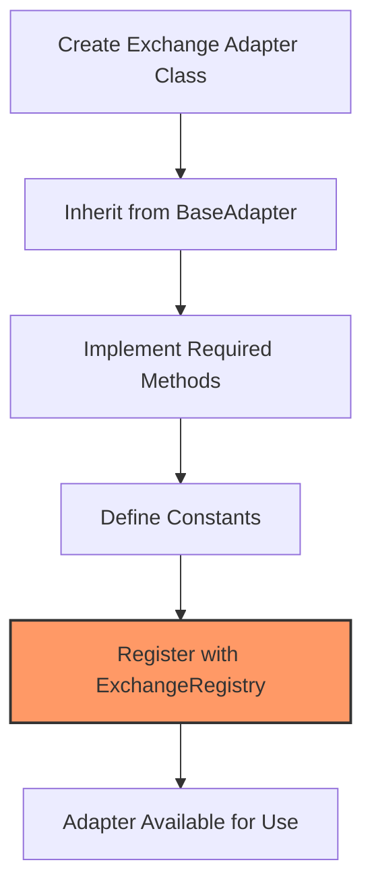
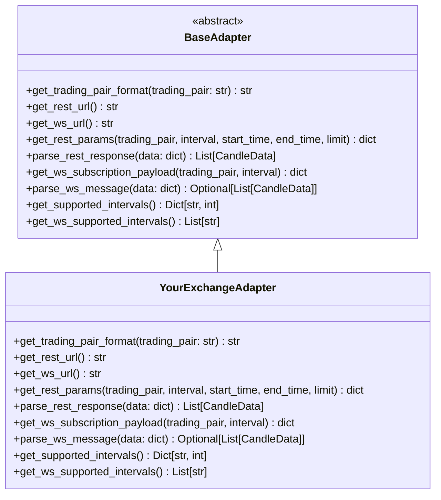

# Adding New Exchange Adapters

This section provides a guide to adding support for a new exchange to the Candles Feed framework. By implementing an adapter, you can seamlessly integrate a new exchange into the framework.

## What is an Exchange Adapter?

An exchange adapter is a class that implements the `BaseAdapter` interface and provides exchange-specific logic for:

1. Formatting trading pairs
2. Constructing REST API requests
3. Parsing REST API responses
4. Creating WebSocket subscription payloads
5. Parsing WebSocket messages
6. Defining supported intervals

The adapter serves as a bridge between the exchange's API and the standardized data format used by the framework.

## Adapter Registration Process



## Required Components

To add support for a new exchange, you'll need to create:

1. A constants file with exchange-specific values
2. An adapter class implementing the `BaseAdapter` interface
3. An `__init__.py` file to expose your adapter

## Project Structure

Your adapter should follow this structure:

```
candles_feed/
└── adapters/
    └── your_exchange_name/
        ├── __init__.py
        ├── constants.py
        └── your_exchange_adapter.py
```

## Registration

To make your adapter available to the framework, you need to register it with the `ExchangeRegistry`:

```python
@ExchangeRegistry.register("your_exchange_name")
class YourExchangeAdapter(BaseAdapter):
    """Your exchange adapter implementation."""
    # Implementation details here
```

## Adapter Interface

Your adapter must implement all methods defined in the `BaseAdapter` class:



## Next Steps

In the following sections, we'll walk through the process of implementing each part of an exchange adapter:

1. [Adapter Implementation](implementation.md): Creating the basic adapter structure
2. [REST API Integration](rest_api.md): Implementing REST API functionality
3. [WebSocket Integration](websocket.md): Implementing WebSocket functionality
4. [Testing Your Adapter](testing.md): Ensuring your adapter works correctly