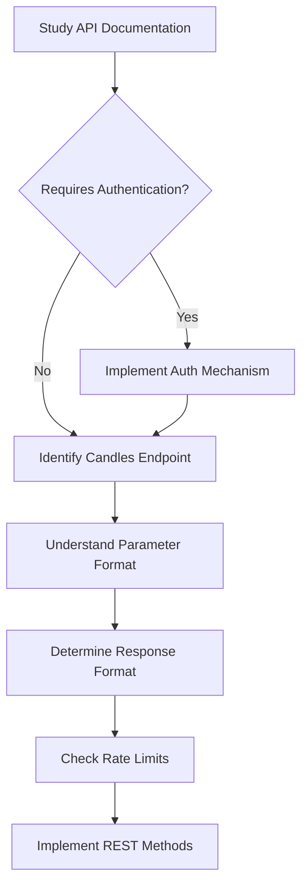
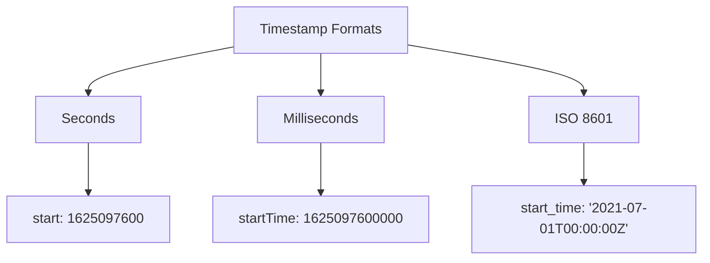

# REST API Integration

This guide focuses on implementing the REST API aspects of your exchange adapter. Proper REST API integration is crucial for fetching historical candle data and providing a fallback when WebSocket connectivity is unavailable.

## Understanding Exchange REST API

Before implementing, thoroughly understand how the exchange's REST API works:



## REST Methods Implementation

Your adapter needs to implement these REST-related methods:

1. `get_rest_url()`: Returns the REST API URL
2. `get_rest_params()`: Creates parameters for the REST request
3. `parse_rest_response()`: Parses the REST API response into CandleData objects

Let's look at each in detail:

### 1. Implementing `get_rest_url()`

```python
def get_rest_url(self) -> str:
    """Get REST API URL for candles.
    
    Returns:
        REST API URL
    """
    # For most exchanges, this is a simple concatenation
    return f"{REST_URL}{CANDLES_ENDPOINT}"
    
    # Some exchanges might require path parameters in the URL
    # Example: return f"{REST_URL}{CANDLES_ENDPOINT}".format(product_id=some_id)
```

### 2. Implementing `get_rest_params()`

This method creates the parameter dictionary for REST API requests:

```python
def get_rest_params(self, 
                  trading_pair: str, 
                  interval: str, 
                  start_time: Optional[int] = None, 
                  end_time: Optional[int] = None, 
                  limit: Optional[int] = None) -> dict:
    """Get parameters for REST API request."""
    # Basic parameters needed for most exchanges
    params = {
        "symbol": self.get_trading_pair_format(trading_pair),
        "interval": self._convert_interval_to_exchange_format(interval),
        "limit": limit or MAX_RESULTS_PER_CANDLESTICK_REST_REQUEST
    }
    
    # Handle timestamps according to exchange requirements
    if start_time is not None:
        # Some exchanges require milliseconds
        params["startTime"] = start_time * 1000  # Convert to milliseconds
        # Or some might use a different parameter name
        # params["from"] = start_time
        
    if end_time is not None:
        # Some exchanges require milliseconds
        params["endTime"] = end_time * 1000  # Convert to milliseconds
        # Or some might use a different parameter name
        # params["to"] = end_time
        
    return params
```

### 3. Implementing `parse_rest_response()`

This method parses the exchange's response into standardized `CandleData` objects:

```python
def parse_rest_response(self, data: dict) -> List[CandleData]:
    """Parse REST API response into CandleData objects."""
    candles = []
    
    # Extract data based on exchange's response format
    # This will vary significantly between exchanges
    response_data = data.get("candles", [])  # Adjust key based on exchange's format
    
    for item in response_data:
        # For array-based responses
        if isinstance(item, list):
            # Adjust indices based on exchange's format
            candles.append(CandleData(
                timestamp_raw=item[0],        # Timestamp
                open=float(item[1]),          # Open price
                high=float(item[2]),          # High price
                low=float(item[3]),           # Low price
                close=float(item[4]),         # Close price
                volume=float(item[5]),        # Volume
                quote_asset_volume=float(item[6]) if len(item) > 6 else 0.0,
                n_trades=int(item[7]) if len(item) > 7 else 0,
                taker_buy_base_volume=float(item[8]) if len(item) > 8 else 0.0,
                taker_buy_quote_volume=float(item[9]) if len(item) > 9 else 0.0
            ))
        
        # For object-based responses
        elif isinstance(item, dict):
            # Adjust keys based on exchange's format
            candles.append(CandleData(
                timestamp_raw=item.get("time", 0),       # Timestamp
                open=float(item.get("open", 0)),         # Open price
                high=float(item.get("high", 0)),         # High price
                low=float(item.get("low", 0)),           # Low price
                close=float(item.get("close", 0)),       # Close price
                volume=float(item.get("volume", 0)),     # Volume
                quote_asset_volume=float(item.get("quoteVolume", 0)),
                n_trades=int(item.get("trades", 0)),
                taker_buy_base_volume=float(item.get("takerBuyVolume", 0)),
                taker_buy_quote_volume=float(item.get("takerBuyQuoteVolume", 0))
            ))
    
    return candles
```

## Common REST API Patterns

Different exchanges structure their REST APIs differently. Here are common patterns:

### Timestamp Formats

Exchanges use various timestamp formats:



Always validate the timestamps and convert them to the framework's standard format (seconds).

### Interval Formats

Exchanges use different formats for intervals:

| Exchange | 1 minute | 1 hour | 1 day |
|----------|----------|--------|-------|
| Binance  | "1m"     | "1h"   | "1d"  |
| Bybit    | "1"      | "60"   | "D"   |
| KuCoin   | "1min"   | "1hour"| "1day"|
| OKX      | "1m"     | "1H"   | "1D"  |

Create a mapping in your constants file:

```python
INTERVAL_TO_EXCHANGE_FORMAT = {
    "1m": "1min",   # Standard -> Exchange format
    "5m": "5min",
    "1h": "60min",
    "1d": "1day"
}
```

Then use it in your `get_rest_params()` method:

```python
params["interval"] = INTERVAL_TO_EXCHANGE_FORMAT.get(interval, interval)
```

### Response Formats

Exchanges structure their responses differently:

#### Array-Based Response

```json
{
  "data": [
    [1625097600, "34500.5", "34650.0", "34400.2", "34600.1", "120.5"],
    [1625097660, "34600.1", "34700.0", "34550.0", "34650.8", "95.2"]
  ]
}
```

#### Object-Based Response

```json
{
  "candles": [
    {
      "time": 1625097600,
      "open": "34500.5",
      "high": "34650.0",
      "low": "34400.2",
      "close": "34600.1",
      "volume": "120.5"
    },
    {
      "time": 1625097660,
      "open": "34600.1",
      "high": "34700.0",
      "low": "34550.0",
      "close": "34650.8",
      "volume": "95.2"
    }
  ]
}
```

## Error Handling

Implement robust error handling in your REST API methods:

```python
def parse_rest_response(self, data: dict) -> List[CandleData]:
    """Parse REST API response into CandleData objects."""
    candles = []
    
    # Check for error response
    if "error" in data and data["error"]:
        error_msg = data.get("message", "Unknown error")
        raise ValueError(f"Exchange error: {error_msg}")
    
    # Check if data is in expected format
    if "candles" not in data:
        raise ValueError(f"Unexpected response format: {data}")
    
    # Parse candles with validation
    for item in data["candles"]:
        try:
            candles.append(CandleData(
                timestamp_raw=item.get("time", 0),
                open=float(item.get("open", 0)),
                high=float(item.get("high", 0)),
                low=float(item.get("low", 0)),
                close=float(item.get("close", 0)),
                volume=float(item.get("volume", 0))
            ))
        except (ValueError, TypeError) as e:
            # Log error but continue processing
            logger.warning(f"Error parsing candle data: {e}, data: {item}")
    
    return candles
```

## Rate Limiting

Respect the exchange's rate limits to avoid being banned:

```python
# In your constants.py file
RATE_LIMITS = [
    RateLimit(limit_id="CANDLES", limit=60, time_interval=60)  # 60 requests per minute
]

# In your adapter implementation
def get_rate_limits(self) -> List[RateLimit]:
    """Get rate limits for the exchange."""
    return RATE_LIMITS
```

## Testing REST API Integration

Test your REST implementation with various scenarios:

1. Fetching recent candles
2. Fetching historical candles
3. Handling pagination
4. Error conditions
5. Rate limit behavior

Example test:

```python
def test_parse_rest_response():
    """Test parsing REST response."""
    adapter = YourExchangeAdapter()
    
    # Sample response data
    response = {
        "candles": [
            {
                "time": 1625097600,
                "open": "34500.5",
                "high": "34650.0",
                "low": "34400.2",
                "close": "34600.1",
                "volume": "120.5"
            }
        ]
    }
    
    candles = adapter.parse_rest_response(response)
    
    assert len(candles) == 1
    assert candles[0].timestamp == 1625097600
    assert candles[0].open == 34500.5
    assert candles[0].high == 34650.0
    assert candles[0].low == 34400.2
    assert candles[0].close == 34600.1
    assert candles[0].volume == 120.5
```

## Next Steps

After implementing REST API functionality, proceed to:

1. [WebSocket Integration](websocket.md): Implementing real-time data collection
2. [Testing Your Adapter](testing.md): Comprehensive testing strategy