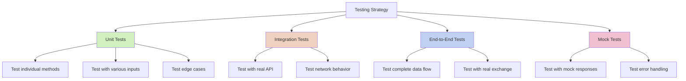

# Testing Your Adapter

A thoroughly tested adapter ensures reliability and robustness. This guide covers strategies for testing your exchange adapter implementation.

## Testing Strategy Overview

A comprehensive testing strategy includes:



## Unit Tests

Unit tests verify individual components of your adapter work correctly in isolation:

### 1. Testing `get_trading_pair_format()`

```python
def test_get_trading_pair_format():
    """Test trading pair format conversion."""
    adapter = YourExchangeAdapter()
    
    # Test with various trading pairs
    assert adapter.get_trading_pair_format("BTC-USDT") == "BTCUSDT"
    assert adapter.get_trading_pair_format("ETH-BTC") == "ETHBTC"
    assert adapter.get_trading_pair_format("SOL-USDC") == "SOLUSDC"
    
    # Test with special cases if your exchange has them
    assert adapter.get_trading_pair_format("BTC-USD") == "BTC-USD"  # Kraken example
```

### 2. Testing `get_rest_params()`

```python
def test_get_rest_params():
    """Test REST API parameters generation."""
    adapter = YourExchangeAdapter()
    
    # Test with minimal parameters
    params = adapter.get_rest_params("BTC-USDT", "1m")
    assert params["symbol"] == "BTCUSDT"
    assert params["interval"] == "1m"
    assert "limit" in params
    
    # Test with all parameters
    params = adapter.get_rest_params(
        "ETH-USDT", 
        "1h", 
        start_time=1625097600,
        end_time=1625184000,
        limit=500
    )
    assert params["symbol"] == "ETHUSDT"
    assert params["interval"] == "1h"
    assert params["limit"] == 500
    # Check timestamp formats (adjust based on your exchange)
    assert params["startTime"] == 1625097600000  # If exchange uses milliseconds
    assert params["endTime"] == 1625184000000
```

### 3. Testing `parse_rest_response()`

```python
def test_parse_rest_response():
    """Test parsing REST API responses."""
    adapter = YourExchangeAdapter()
    
    # Sample response based on your exchange's format
    response = {
        "candles": [
            # Format depends on exchange
            {
                "timestamp": 1625097600000,
                "open": "35000.0",
                "high": "35100.0",
                "low": "34900.0",
                "close": "35050.0",
                "volume": "10.5"
            }
        ]
    }
    
    candles = adapter.parse_rest_response(response)
    
    # Verify results
    assert len(candles) == 1
    assert candles[0].timestamp == 1625097600  # Should be in seconds
    assert candles[0].open == 35000.0
    assert candles[0].high == 35100.0
    assert candles[0].low == 34900.0
    assert candles[0].close == 35050.0
    assert candles[0].volume == 10.5
```

### 4. Testing `parse_ws_message()`

```python
def test_parse_ws_message():
    """Test parsing WebSocket messages."""
    adapter = YourExchangeAdapter()
    
    # Test with candle update message
    message = {
        # Format depends on exchange
        "e": "kline",
        "k": {
            "t": 1625097600000,
            "o": "35000.0",
            "h": "35100.0",
            "l": "34900.0",
            "c": "35050.0",
            "v": "10.5"
        }
    }
    
    candles = adapter.parse_ws_message(message)
    
    # Verify results
    assert candles is not None
    assert len(candles) == 1
    assert candles[0].timestamp == 1625097600  # Should be in seconds
    assert candles[0].open == 35000.0
    
    # Test with non-candle message
    other_message = {"type": "ping"}
    assert adapter.parse_ws_message(other_message) is None
```

### 5. Testing Interval Support

```python
def test_supported_intervals():
    """Test interval support methods."""
    adapter = YourExchangeAdapter()
    
    # Test supported intervals
    intervals = adapter.get_supported_intervals()
    assert "1m" in intervals
    assert "1h" in intervals
    assert intervals["1m"] == 60
    assert intervals["1h"] == 3600
    
    # Test WebSocket-supported intervals
    ws_intervals = adapter.get_ws_supported_intervals()
    assert isinstance(ws_intervals, list)
    # Check specific intervals
    assert "1m" in ws_intervals
```

## Integration Tests with Mocks

Test your adapter with mocked network responses:

```python
@pytest.mark.asyncio
async def test_fetch_candles_with_mock():
    """Test fetching candles with mock responses."""
    # Create adapter
    adapter = YourExchangeAdapter()
    
    # Create mock for network client
    mock_client = MagicMock()
    mock_client.get_rest_data = AsyncMock()
    
    # Set up mock response
    mock_response = {
        "candles": [
            # Exchange-specific format
        ]
    }
    mock_client.get_rest_data.return_value = mock_response
    
    # Create strategy with mocks
    strategy = RESTPollingStrategy(
        network_client=mock_client,
        adapter=adapter,
        trading_pair="BTC-USDT",
        interval="1m",
        data_processor=DataProcessor(),
        candles_store=deque(maxlen=100)
    )
    
    # Test fetch_candles
    candles = await strategy.fetch_candles(
        start_time=1625097600,
        end_time=1625184000
    )
    
    # Verify mock was called with correct params
    expected_params = adapter.get_rest_params(
        "BTC-USDT", "1m", 
        start_time=1625097600,
        end_time=1625184000
    )
    mock_client.get_rest_data.assert_called_once()
    args, kwargs = mock_client.get_rest_data.call_args
    assert kwargs["params"] == expected_params
    
    # Verify results
    assert len(candles) > 0
```

## Integration Tests with Real API

Test your adapter with the actual exchange API:

```python
@pytest.mark.integration
@pytest.mark.asyncio
async def test_real_api_fetch():
    """Test fetching from real API.
    
    Note: These tests require internet connection and may be rate-limited.
    """
    # Create real adapter and components
    adapter = YourExchangeAdapter()
    throttler = AsyncThrottler(rate_limits=[])
    network_client = NetworkClient(throttler)
    data_processor = DataProcessor()
    
    # Create strategy
    strategy = RESTPollingStrategy(
        network_client=network_client,
        adapter=adapter,
        trading_pair="BTC-USDT",
        interval="1m",
        data_processor=data_processor,
        candles_store=deque(maxlen=100)
    )
    
    # Fetch recent candles
    end_time = int(time.time())
    start_time = end_time - 3600  # Last hour
    
    candles = await strategy.fetch_candles(
        start_time=start_time,
        end_time=end_time
    )
    
    # Verify results
    assert len(candles) > 0
    assert all(isinstance(c, CandleData) for c in candles)
    assert all(start_time <= c.timestamp <= end_time for c in candles)
    
    # Verify candles are properly formatted
    for candle in candles:
        assert candle.high >= candle.low
        assert candle.high >= candle.open
        assert candle.high >= candle.close
        assert candle.low <= candle.open
        assert candle.low <= candle.close
        assert candle.volume >= 0
```

## WebSocket Tests

Test WebSocket functionality:

```python
@pytest.mark.asyncio
async def test_websocket_subscription():
    """Test WebSocket subscription with mock."""
    # Create adapter
    adapter = YourExchangeAdapter()
    
    # Create mock WebSocket assistant
    mock_ws = AsyncMock()
    mock_ws.connect = AsyncMock()
    mock_ws.send = AsyncMock()
    mock_ws.disconnect = AsyncMock()
    
    # Create mock for iter_messages
    message_queue = asyncio.Queue()
    
    # Add sample messages to queue
    await message_queue.put(MagicMock(data={"type": "subscription_success"}))
    await message_queue.put(MagicMock(data={"e": "kline", "k": {...}}))
    
    # Mock the iter_messages method
    async def mock_iter_messages():
        while not message_queue.empty():
            yield await message_queue.get()
    
    mock_ws.iter_messages = mock_iter_messages
    
    # Create mock network client
    mock_client = MagicMock()
    mock_client.establish_ws_connection = AsyncMock(return_value=mock_ws)
    mock_client.send_ws_message = AsyncMock()
    
    # Create strategy
    strategy = WebSocketStrategy(
        network_client=mock_client,
        adapter=adapter,
        trading_pair="BTC-USDT",
        interval="1m",
        data_processor=DataProcessor(),
        candles_store=deque(maxlen=100)
    )
    
    # Start strategy (will connect and subscribe)
    await strategy.start()
    
    # Wait for messages to be processed
    await asyncio.sleep(0.1)
    
    # Verify connection and subscription
    mock_client.establish_ws_connection.assert_called_once_with(adapter.get_ws_url())
    mock_client.send_ws_message.assert_called_once()
    
    # Clean up
    await strategy.stop()
    mock_ws.disconnect.assert_called_once()
```

## End-to-End Tests

Test the complete flow using the `CandlesFeed` class:

```python
@pytest.mark.integration
@pytest.mark.asyncio
async def test_candles_feed_e2e():
    """Test complete candles feed flow."""
    # Create adapter
    adapter = YourExchangeAdapter()
    
    # Create candles feed
    feed = CandlesFeed(
        adapter=adapter,
        trading_pair="BTC-USDT",
        interval="1m",
        max_records=100
    )
    
    # Start feed
    await feed.start()
    
    # Wait for some data
    start_time = time.time()
    while not feed.ready and time.time() - start_time < 30:
        await asyncio.sleep(1)
        
    # Get data as dataframe
    df = feed.get_candles_df()
    
    # Verify we have data
    assert not df.empty
    assert all(col in df.columns for col in [
        "timestamp", "open", "high", "low", "close", "volume"
    ])
    
    # Clean up
    await feed.stop()
```

## Test For Edge Cases

Be sure to test various edge cases:

1. **Invalid Inputs**: Test with invalid trading pairs, intervals, timestamps
2. **Error Responses**: Test handling of API errors and rate limiting
3. **Empty Results**: Test with empty response data
4. **Missing Fields**: Test with responses missing some fields
5. **Connection Issues**: Test recovery from network interruptions
6. **Partial Updates**: Test handling of partial candle updates

```python
def test_parse_rest_response_empty():
    """Test parsing empty REST response."""
    adapter = YourExchangeAdapter()
    
    # Empty response
    response = {"candles": []}
    candles = adapter.parse_rest_response(response)
    assert len(candles) == 0
    
    # Missing 'candles' key
    response = {"other": []}
    candles = adapter.parse_rest_response(response)
    assert len(candles) == 0

def test_parse_rest_response_missing_fields():
    """Test parsing REST response with missing fields."""
    adapter = YourExchangeAdapter()
    
    # Response with missing fields
    response = {
        "candles": [
            {
                "timestamp": 1625097600000,
                "open": "35000.0",
                # Missing high, low
                "close": "35050.0",
                "volume": "10.5"
            }
        ]
    }
    
    # Adapter should handle missing fields gracefully
    candles = adapter.parse_rest_response(response)
    assert len(candles) == 1
    assert candles[0].high == 0.0  # Default value
    assert candles[0].low == 0.0   # Default value
```

## Continuous Integration

Set up CI to run tests automatically:

```yaml
# .github/workflows/test.yml
name: Tests

on:
  push:
    branches: [ main ]
  pull_request:
    branches: [ main ]

jobs:
  test:
    runs-on: ubuntu-latest
    
    steps:
    - uses: actions/checkout@v3
    - name: Set up Python
      uses: actions/setup-python@v4
      with:
        python-version: 3.9
        
    - name: Install dependencies
      run: |
        python -m pip install --upgrade pip
        pip install pytest pytest-asyncio aioresponses
        pip install -e .
        
    - name: Test with pytest
      run: |
        pytest tests/unit
        
    - name: Integration tests
      if: github.event_name == 'push'
      run: |
        pytest tests/integration -m "not slow"
```

## Test Documentation

Document your test approach in your code:

```python
"""Tests for YourExchangeAdapter.

This module provides tests for the YourExchange adapter implementation.

Test categories:
1. Unit tests: Test individual methods
2. Integration tests: Test with (mocked) API
3. End-to-end tests: Test complete flow

Run tests with:
  pytest -xvs tests/adapters/your_exchange_name/

Run only unit tests:
  pytest -xvs tests/adapters/your_exchange_name/ -k "not integration"

Run only integration tests:
  pytest -xvs tests/adapters/your_exchange_name/ -k "integration"
"""
```

## Test Directory Structure

Organize your tests in a structure mirroring your implementation:

```
tests/
└── adapters/
    └── your_exchange_name/
        ├── __init__.py
        ├── test_your_exchange_adapter.py
        ├── test_rest_integration.py
        └── test_ws_integration.py
```

## Final Checklist

Before submitting your adapter, ensure:

- [ ] All unit tests pass
- [ ] Integration tests with mock API pass
- [ ] Integration tests with real API pass (if possible)
- [ ] WebSocket tests pass
- [ ] Edge cases are handled gracefully
- [ ] Code follows project style guide
- [ ] Documentation is complete
- [ ] Example usage is provided

With thorough testing, your adapter will be reliable and maintainable, providing a solid foundation for traders using the framework with your exchange.

## Next Steps

After completing and testing your adapter, consider:

1. Submitting a pull request to contribute it to the main repository
2. Adding advanced features like authentication for private endpoints
3. Creating examples demonstrating your adapter's usage
4. Writing documentation for exchange-specific quirks or features