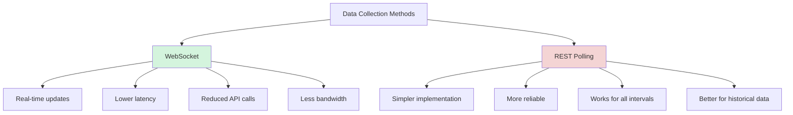
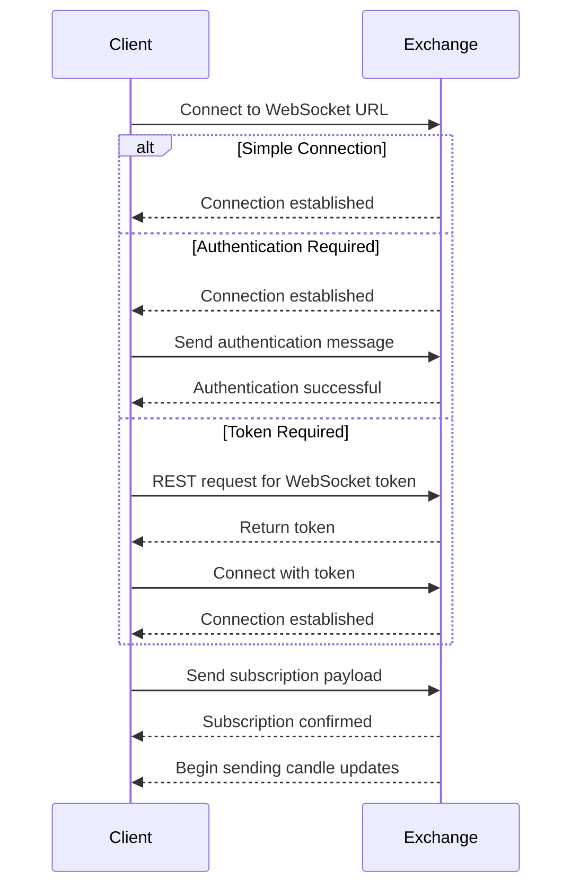

# WebSocket Integration

WebSocket integration is crucial for receiving real-time candle updates from exchanges. This guide covers how to implement WebSocket functionality in your exchange adapter.

## WebSocket vs REST

Before diving into implementation, understand the benefits of WebSocket:



## WebSocket Methods Implementation

Your adapter needs to implement these WebSocket-related methods:

1. `get_ws_url()`: Returns the WebSocket URL
2. `get_ws_subscription_payload()`: Creates the subscription payload
3. `parse_ws_message()`: Parses WebSocket messages into CandleData objects
4. `get_ws_supported_intervals()`: Returns intervals supported via WebSocket

Let's explore each method in detail:

### 1. Implementing `get_ws_url()`

```python
def get_ws_url(self) -> str:
    """Get WebSocket URL.

    Returns:
        WebSocket URL
    """
    return WSS_URL  # Defined in constants.py

    # Some exchanges might have environment-specific URLs
    # Example: return f"wss://{self.domain}/ws"
```

### 2. Implementing `get_ws_subscription_payload()`

This method creates the payload for subscribing to candle updates:

```python
def get_ws_subscription_payload(self, trading_pair: str, interval: str) -> dict:
    """Get WebSocket subscription payload.

    Args:
        trading_pair: Trading pair
        interval: Candle interval

    Returns:
        WebSocket subscription payload
    """
    # Format varies significantly between exchanges
    formatted_pair = self.get_trading_pair_format(trading_pair)

    # Example for a simple JSON-based subscription
    return {
        "method": "subscribe",
        "params": [
            f"candle.{interval}.{formatted_pair}"
        ],
        "id": 1  # Some exchanges require an ID
    }

    # Alternative example for an exchange with different format
    # return {
    #     "op": "subscribe",
    #     "args": [{
    #         "channel": "candlestick",
    #         "instId": formatted_pair,
    #         "interval": interval
    #     }]
    # }
```

### 3. Implementing `parse_ws_message()`

This method parses WebSocket messages into CandleData objects:

```python
def parse_ws_message(self, data: dict) -> Optional[List[CandleData]]:
    """Parse WebSocket message into CandleData objects.

    Args:
        data: WebSocket message

    Returns:
        List of CandleData objects or None if message is not a candle update
    """
    # Check if this is a candle update message
    if not self._is_candle_message(data):
        return None

    candles = []

    # Extract candle data from the message
    # This will vary significantly between exchanges

    # Example for an exchange with a simple format
    if "data" in data and isinstance(data["data"], dict):
        candle = data["data"]
        candles.append(CandleData(
            timestamp_raw=candle.get("t", 0),       # Timestamp
            open=float(candle.get("o", 0)),         # Open price
            high=float(candle.get("h", 0)),         # High price
            low=float(candle.get("l", 0)),          # Low price
            close=float(candle.get("c", 0)),        # Close price
            volume=float(candle.get("v", 0)),       # Volume
            quote_asset_volume=float(candle.get("q", 0)),
            n_trades=int(candle.get("n", 0)),
            taker_buy_base_volume=float(candle.get("V", 0)),
            taker_buy_quote_volume=float(candle.get("Q", 0))
        ))

    return candles if candles else None

def _is_candle_message(self, data: dict) -> bool:
    """Check if the WebSocket message is a candle update.

    Args:
        data: WebSocket message

    Returns:
        True if the message is a candle update, False otherwise
    """
    # Implement logic to check if this is a candle message
    # Example:
    return (
        isinstance(data, dict) and
        data.get("e") == "kline" and
        "k" in data
    )
```

### 4. Implementing `get_ws_supported_intervals()`

Not all exchanges support all intervals via WebSocket. This method returns the supported intervals:

```python
def get_ws_supported_intervals(self) -> List[str]:
    """Get intervals supported by WebSocket API.

    Returns:
        List of interval strings supported by WebSocket API
    """
    return WS_INTERVALS  # Defined in constants.py
```

## Common WebSocket Patterns

Different exchanges structure their WebSocket APIs differently. Here are common patterns:

### Connection Establishment

Some exchanges require special steps to establish a WebSocket connection:



Implement the appropriate connection logic:

```python
# For exchanges requiring token (e.g., KuCoin)
async def _get_ws_token(self) -> str:
    """Get WebSocket token from REST API."""
    # Implement token retrieval logic
    rest_assistant = await self._api_factory.get_rest_assistant()
    response = await rest_assistant.execute_request(
        url=f"{REST_URL}{TOKEN_ENDPOINT}",
        method=RESTMethod.POST
    )
    return response["token"]

# Then use the token in get_ws_url
def get_ws_url(self) -> str:
    """Get WebSocket URL with token."""
    token = self._get_ws_token()
    return f"{WSS_URL}?token={token}"
```

### Subscription Confirmation

Most exchanges send a confirmation message after subscribing:

```python
def parse_ws_message(self, data: dict) -> Optional[List[CandleData]]:
    """Parse WebSocket message."""
    # Check if this is a subscription confirmation
    if self._is_subscription_confirmation(data):
        # Log successful subscription
        logger.info(f"Successfully subscribed to candle updates: {data}")
        return None

    # Continue with normal parsing...

def _is_subscription_confirmation(self, data: dict) -> bool:
    """Check if the message is a subscription confirmation."""
    # Example implementation
    return (
        isinstance(data, dict) and
        data.get("type") == "subscribed" and
        "candle" in data.get("channel", "")
    )
```

### Ping/Pong Messages

Many WebSocket connections require ping/pong messages to keep the connection alive:

```python
def parse_ws_message(self, data: dict) -> Optional[List[CandleData]]:
    """Parse WebSocket message."""
    # Check if this is a ping message
    if self._is_ping_message(data):
        # Return a pong message that the WebSocketStrategy will send
        return WSJSONRequest(payload=self._get_pong_payload(data))

    # Continue with normal parsing...

def _is_ping_message(self, data: dict) -> bool:
    """Check if the message is a ping request."""
    # Example implementation
    return data.get("op") == "ping"

def _get_pong_payload(self, ping_data: dict) -> dict:
    """Create pong response from ping data."""
    # Example implementation
    return {
        "op": "pong",
        "ts": ping_data.get("ts", int(time.time() * 1000))
    }
```

## WebSocket Message Formats

Exchanges use various formats for WebSocket messages:

### Binance Format

```json
{
  "e": "kline",
  "E": 1672515782136,
  "s": "BTCUSDT",
  "k": {
    "t": 1672515780000,
    "T": 1672515839999,
    "s": "BTCUSDT",
    "i": "1m",
    "f": 123456,
    "L": 123457,
    "o": "16500.10",
    "c": "16505.20",
    "h": "16510.30",
    "l": "16495.40",
    "v": "5.123",
    "n": 100,
    "x": false,
    "q": "84528.9",
    "V": "2.56",
    "Q": "42230.1"
  }
}
```

### Coinbase Format

```json
{
  "channel": "candles",
  "timestamp": "2023-01-01T00:00:00.000Z",
  "events": [
    {
      "type": "candle",
      "candles": [
        {
          "start": "2023-01-01T00:00:00.000Z",
          "low": "16495.40",
          "high": "16510.30",
          "open": "16500.10",
          "close": "16505.20",
          "volume": "5.123"
        }
      ]
    }
  ]
}
```

### OKX Format

```json
{
  "arg": {
    "channel": "candle1m",
    "instId": "BTC-USDT"
  },
  "data": [
    [
      "1672515780000",
      "16500.10",
      "16510.30",
      "16495.40",
      "16505.20",
      "5.123",
      "84528.9"
    ]
  ]
}
```

## WebSocket Error Handling

Implement robust error handling for WebSocket connections:

```python
# In your WebSocketStrategy class
async def _listen_for_updates(self):
    """Listen for WebSocket updates."""
    while self._running:
        try:
            # Establish connection
            ws_url = self.adapter.get_ws_url()
            self._ws_assistant = await self.network_client.establish_ws_connection(ws_url)

            # Subscribe to updates
            payload = self.adapter.get_ws_subscription_payload(self.trading_pair, self.interval)
            await self.network_client.send_ws_message(self._ws_assistant, payload)

            # Process messages
            async for message in self._ws_assistant.iter_messages():
                # Process message...

        except ConnectionError as e:
            logger.warning(f"WebSocket connection error: {e}, reconnecting...")
            await asyncio.sleep(1.0)

        except Exception as e:
            logger.error(f"Unexpected WebSocket error: {e}, reconnecting...")
            await asyncio.sleep(5.0)

        finally:
            # Clean up connection
            if self._ws_assistant:
                try:
                    await self._ws_assistant.disconnect()
                except:
                    pass
                self._ws_assistant = None
```

## Fallback to REST

For exchanges with limited WebSocket support, implement fallback to REST polling:

```python
def get_ws_supported_intervals(self) -> List[str]:
    """Get intervals supported by WebSocket API."""
    # If WebSocket doesn't support candles at all
    return []  # Empty list means no WebSocket support

    # Or for partial support
    return ["1m", "5m"]  # Only these intervals are supported
```

The framework will automatically use REST polling for intervals not supported by WebSocket.

## Testing WebSocket Integration

Test your WebSocket implementation with these scenarios:

1. Connecting and subscribing
2. Handling real-time updates
3. Reconnecting after disconnection
4. Processing different message types (candles, heartbeats, errors)
5. Fallback to REST when needed

Example test:

```python
def test_parse_ws_message():
    """Test parsing WebSocket messages."""
    adapter = YourExchangeAdapter()

    # Sample WebSocket message
    message = {
        "e": "kline",
        "E": 1672515782136,
        "s": "BTCUSDT",
        "k": {
            "t": 1672515780000,
            "o": "16500.10",
            "c": "16505.20",
            "h": "16510.30",
            "l": "16495.40",
            "v": "5.123"
        }
    }

    candles = adapter.parse_ws_message(message)

    assert candles is not None
    assert len(candles) == 1
    assert candles[0].timestamp == 1672515780
    assert candles[0].open == 16500.10
    assert candles[0].high == 16510.30
    assert candles[0].low == 16495.40
    assert candles[0].close == 16505.20
    assert candles[0].volume == 5.123
```

## Next Steps

After implementing WebSocket functionality, proceed to:

- [Testing Your Adapter](testing.md): Comprehensive testing strategy for your adapter
