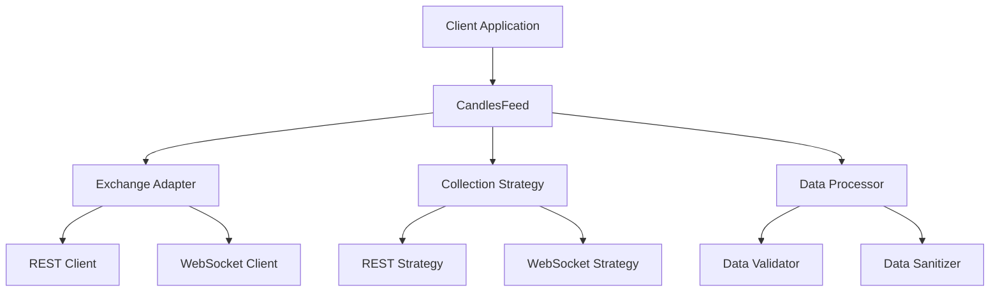

# Developer Onboarding Guide

Welcome to the Candles Feed Framework development team! This guide will help you get up to speed quickly and start contributing effectively.

## Table of Contents

- [Project Overview](#project-overview)
- [Development Environment Setup](#development-environment-setup)
- [Architecture Understanding](#architecture-understanding)
- [Development Workflow](#development-workflow)
- [Key Concepts](#key-concepts)
- [Testing Strategy](#testing-strategy)
- [Documentation](#documentation)
- [Getting Your First PR Merged](#getting-your-first-pr-merged)
- [Resources and Support](#resources-and-support)

## Project Overview

### What is Candles Feed Framework?

The Candles Feed Framework is a modular, plugin-based system for fetching and managing candlestick data from cryptocurrency exchanges. It's designed to be:

- **Extensible**: Easy to add new exchange adapters
- **Reliable**: Robust error handling and recovery
- **Fast**: Optimized for high-throughput data processing
- **Type-Safe**: Comprehensive type annotations
- **Well-Tested**: Extensive test coverage across all components

### Key Use Cases

1. **Trading Bot Integration**: Provide real-time market data to trading algorithms
2. **Market Analysis**: Historical data collection for backtesting and analysis
3. **Data Pipeline**: Part of larger cryptocurrency data processing systems
4. **Research**: Academic and commercial research into market dynamics

### Supported Exchanges

Currently supported exchanges include:
- Binance (Spot & Perpetual)
- Bybit (Spot & Perpetual)
- Coinbase Advanced Trade
- Kraken Spot
- KuCoin (Spot & Perpetual)
- OKX (Spot & Perpetual)
- Gate.io (Spot & Perpetual)
- And more...

## Development Environment Setup

### Prerequisites

- **Python 3.10+**: Modern Python with type hinting support
- **Git**: Version control
- **Package Manager**: Either Pixi (recommended) or Hatch

### Quick Setup

#### Option 1: Pixi (Recommended)

```bash
# Install Pixi
curl -fsSL https://pixi.sh/install.sh | bash

# Clone repository
git clone https://github.com/MementoRC/hb-candles-feed.git
cd hb-candles-feed

# Install dependencies
pixi install

# Activate environment
pixi shell

# Verify setup
pixi run test
```

#### Option 2: Hatch

```bash
# Install Hatch
pip install hatch

# Clone repository
git clone https://github.com/MementoRC/hb-candles-feed.git
cd hb-candles-feed

# Create environment
hatch env create dev

# Activate environment
hatch shell dev

# Verify setup
hatch run dev:test
```

### IDE Configuration

#### VS Code Setup

1. Install Python extension
2. Open project folder
3. Select Python interpreter from pixi/hatch environment
4. Install recommended extensions:
   - Python
   - Pylint
   - Python Docstring Generator
   - GitLens

#### PyCharm Setup

1. Open project
2. Configure Python interpreter to use pixi/hatch environment
3. Enable type checking
4. Configure code formatter to use Ruff

### Development Tools

```bash
# Available commands (with Pixi)
pixi run test              # Run all tests
pixi run test-unit         # Run unit tests only
pixi run test-integration  # Run integration tests
pixi run lint              # Run linting
pixi run format            # Format code
pixi run typecheck         # Run type checking
pixi run docs-build        # Build documentation
pixi run docs-serve        # Serve docs locally

# Pre-commit hooks
pixi run pre-commit install
pixi run pre-commit run --all-files
```

## Architecture Understanding

### High-Level Architecture



### Core Components

1. **CandlesFeed**: Main entry point and orchestrator
2. **Exchange Adapters**: Exchange-specific implementations
3. **Collection Strategies**: How data is collected (REST vs WebSocket)
4. **Data Processors**: Validation, sanitization, and formatting
5. **Network Clients**: HTTP and WebSocket communication

### Key Design Patterns

- **Adapter Pattern**: Exchange-specific implementations
- **Strategy Pattern**: Different data collection approaches
- **Factory Pattern**: Creating appropriate adapters and strategies
- **Protocol/Interface**: Type-safe contracts between components

## Development Workflow

### Git Workflow

1. **Main Branch**: `main` - Production-ready code
2. **Development Branch**: `development` - Integration branch
3. **Feature Branches**: `feature/description` - Individual features
4. **Bug Fix Branches**: `bugfix/description` - Bug fixes

### Branch Creation

```bash
# Start new feature
git checkout development
git pull origin development
git checkout -b feature/your-feature-name

# Make changes...

# Commit with conventional format
git add .
git commit -m "feat: add new feature description"

# Push and create PR
git push origin feature/your-feature-name
```

### PR Process

1. **Create PR**: Target `development` branch
2. **Fill Template**: Use the PR template
3. **Wait for Review**: At least one maintainer approval required
4. **Address Feedback**: Make requested changes
5. **Merge**: Squash and merge when approved

## Key Concepts

### Exchange Adapters

Adapters implement exchange-specific logic:

```python
from candles_feed.adapters.base_adapter import BaseAdapter

class NewExchangeAdapter(BaseAdapter):
    """Adapter for a new exchange."""

    def __init__(self):
        super().__init__()
        self.exchange_name = "new_exchange"

    async def fetch_rest_candles(
        self,
        trading_pair: str,
        interval: str,
        limit: int = 100
    ) -> list[dict]:
        """Fetch candles via REST API."""
        # Implementation here
        pass
```

### Collection Strategies

Strategies define how data is collected:

```python
from candles_feed.core.collection_strategies import BaseStrategy

class CustomStrategy(BaseStrategy):
    """Custom data collection strategy."""

    async def start(self) -> None:
        """Start data collection."""
        # Implementation here
        pass
```

### Data Flow

1. **Client Request**: Application requests candle data
2. **Adapter Selection**: Framework selects appropriate adapter
3. **Strategy Execution**: Strategy fetches data from exchange
4. **Data Processing**: Raw data is validated and sanitized
5. **Result Delivery**: Processed data returned to client

## Testing Strategy

### Test Categories

1. **Unit Tests**: Test individual components in isolation
2. **Integration Tests**: Test component interactions
3. **End-to-End Tests**: Test complete workflows
4. **Performance Tests**: Benchmark critical operations
5. **Load Tests**: Test under high-throughput conditions

### Writing Tests

```python
import pytest
from unittest.mock import AsyncMock, patch

class TestExchangeAdapter:
    """Test suite for exchange adapter."""

    async def test_fetch_candles_success(self):
        """Test successful candle fetching."""
        # Arrange
        adapter = YourAdapter()
        expected_candles = [{"timestamp": 1234567890, "open": 100.0}]

        # Act
        with patch.object(adapter, '_make_request') as mock_request:
            mock_request.return_value = expected_candles
            result = await adapter.fetch_rest_candles("BTC-USDT", "1m")

        # Assert
        assert result == expected_candles
        mock_request.assert_called_once()

    async def test_fetch_candles_error_handling(self):
        """Test error handling in candle fetching."""
        adapter = YourAdapter()

        with patch.object(adapter, '_make_request') as mock_request:
            mock_request.side_effect = ConnectionError("Network error")

            with pytest.raises(ConnectionError):
                await adapter.fetch_rest_candles("BTC-USDT", "1m")
```

### Running Tests

```bash
# All tests
pixi run test

# Specific test file
pixi run test tests/unit/test_your_module.py

# With coverage
pixi run test --cov=candles_feed --cov-report=html

# Performance tests
pixi run test -m benchmark

# Integration tests
pixi run test-integration
```

### Mock Server

Use the built-in mock server for testing:

```python
from candles_feed.mocking_resources.core.server import MockExchangeServer

async def test_with_mock_server():
    """Test using mock exchange server."""
    async with MockExchangeServer() as server:
        server.add_trading_pair("BTC-USDT", "1m")

        # Your test code here
        adapter = YourAdapter()
        adapter.set_base_url(server.base_url)

        candles = await adapter.fetch_rest_candles("BTC-USDT", "1m")
        assert len(candles) > 0
```

## Documentation

### Types of Documentation

1. **API Documentation**: Auto-generated from docstrings
2. **User Guides**: Step-by-step instructions
3. **Examples**: Working code samples
4. **Architecture**: Design decisions and patterns

### Writing Docstrings

```python
async def fetch_candles(
    trading_pair: str,
    interval: str,
    limit: int = 100
) -> list[dict]:
    """Fetch candles from the exchange.

    :param trading_pair: Trading pair symbol (e.g., 'BTC-USDT')
    :param interval: Time interval for candles ('1m', '5m', '1h', etc.)
    :param limit: Maximum number of candles to fetch
    :return: List of candle data dictionaries
    :raises ValueError: If trading pair format is invalid
    :raises ConnectionError: If unable to connect to exchange

    Example:
        >>> adapter = BinanceAdapter()
        >>> candles = await adapter.fetch_candles('BTC-USDT', '1m', 50)
        >>> print(f"Received {len(candles)} candles")
    """
```

### Building Documentation

```bash
# Build documentation locally
pixi run docs-build

# Serve documentation with live reload
pixi run docs-serve

# Open browser to http://localhost:8000
```

## Getting Your First PR Merged

### Good First Issues

Look for issues labeled:
- `good first issue`
- `documentation`
- `help wanted`
- `enhancement`

### Simple Contribution Ideas

1. **Documentation Improvements**: Fix typos, clarify instructions
2. **Test Coverage**: Add tests for existing functionality
3. **Code Examples**: Add usage examples to documentation
4. **Bug Fixes**: Fix small, well-defined bugs
5. **Exchange Adapters**: Add support for new exchanges

### PR Checklist

Before submitting:

- [ ] Tests pass: `pixi run test`
- [ ] Linting passes: `pixi run lint`
- [ ] Type checking passes: `pixi run typecheck`
- [ ] Documentation updated (if needed)
- [ ] PR template filled out completely
- [ ] Related issues linked

### Common Pitfalls

1. **Large PRs**: Keep changes focused and small
2. **Missing Tests**: Always add tests for new functionality
3. **Outdated Branch**: Rebase on latest development
4. **Unclear Description**: Explain what and why in PR description
5. **Ignoring CI**: Fix any CI failures promptly

## Resources and Support

### Documentation

- **Project Documentation**: [https://mementorc.github.io/hb-candles-feed/](https://mementorc.github.io/hb-candles-feed/)
- **API Reference**: Auto-generated from code
- **Architecture Decisions**: See ADR directory
- **Contributing Guide**: CONTRIBUTING.md in project root

### Communication

- **GitHub Issues**: Bug reports and feature requests
- **GitHub Discussions**: Questions and community discussions
- **Pull Request Reviews**: Code-specific discussions

### Learning Resources

- **Python Type Hints**: [PEP 484](https://peps.python.org/pep-0484/)
- **Async Programming**: [Python asyncio documentation](https://docs.python.org/3/library/asyncio.html)
- **Testing with pytest**: [pytest documentation](https://docs.pytest.org/)
- **Conventional Commits**: [conventionalcommits.org](https://www.conventionalcommits.org/)

### Getting Help

1. **Check Documentation**: Often answers are already documented
2. **Search Issues**: Someone may have asked the same question
3. **Ask in Discussions**: For general questions and ideas
4. **Create Issue**: For specific bugs or feature requests
5. **Tag Maintainers**: In PR reviews if you need specific help

### Mentorship

As a new contributor:

- **Ask Questions**: Don't hesitate to ask for clarification
- **Start Small**: Begin with simple contributions
- **Review Code**: Learn by reviewing others' PRs
- **Pair Programming**: Ask maintainers about pair programming sessions
- **Document Learning**: Share your learning in documentation improvements

## Next Steps

1. **Set Up Environment**: Complete the development setup
2. **Explore Codebase**: Read through the core modules
3. **Run Tests**: Make sure everything works
4. **Pick First Issue**: Choose a good first issue
5. **Make Changes**: Implement your solution
6. **Submit PR**: Follow the PR process
7. **Get Feedback**: Address review comments
8. **Celebrate**: You're now a contributor!

Welcome to the team! We're excited to have you contribute to the Candles Feed Framework.
