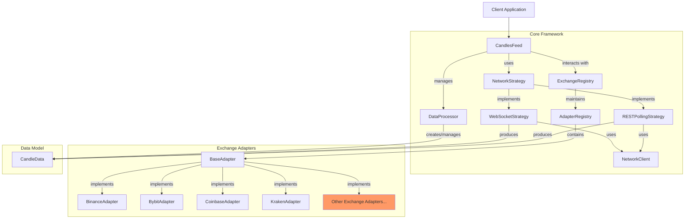
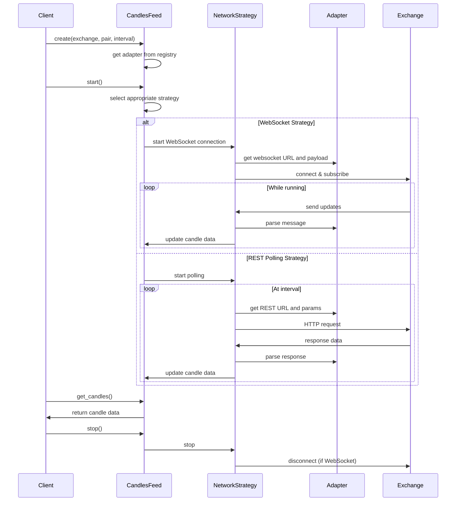

# Architecture Overview

This page provides a detailed overview of the Candles Feed framework architecture, explaining the design principles, key components, and how they interact.

## Design Principles

The Candles Feed framework was designed with the following principles in mind:

1. **Modularity**: Components are designed to be modular and interchangeable, allowing for easy extension and customization.
2. **Separation of Concerns**: Clear separation between different responsibilities (data retrieval, processing, storage).
3. **Extensibility**: New exchange adapters can be added without modifying the core framework.
4. **Resilience**: The system is designed to handle network issues, exchange errors, and other potential failures.
5. **Performance**: Optimized for efficient data processing and memory usage.

## Core Components



## Component Responsibilities

### CandlesFeed

The central coordinator that manages the entire data collection process:

- Initializes and configures the required components
- Selects the appropriate network strategy (WebSocket or REST polling)
- Maintains the candle data collection
- Provides methods to start/stop data collection and access the data

### NetworkStrategy

Abstract strategy for retrieving candle data from exchanges:

- **WebSocketStrategy**: Connects to exchange WebSocket APIs for real-time data
- **RESTPollingStrategy**: Periodically polls exchange REST APIs for data

### ExchangeRegistry

Manages exchange adapter registration and instantiation:

- Discovers available adapters at runtime
- Provides adapter instances on demand
- Allows querying available exchanges

### Adapters

Exchange-specific implementations that handle the details of:

- Formatting trading pairs for the specific exchange
- Constructing API requests in the proper format
- Parsing exchange-specific responses
- Handling exchange-specific error conditions

### Data Processor

Handles the processing and storage of candle data:

- Validates incoming data
- Handles duplicate detection and conflict resolution
- Maintains data consistency

### CandleData

Immutable data model representing a single OHLCV candle:

- Represents standardized candle data across all exchanges
- Contains validation logic to ensure data consistency

## Data Flow



## Implementation Details

### Adapter Registration

Adapters are registered using a decorator pattern:

```python
@ExchangeRegistry.register("binance_spot")
class BinanceSpotAdapter(BinanceBaseAdapter):
    # Implementation details...
```

### Strategy Selection

CandlesFeed automatically selects the appropriate strategy based on:

1. The specified strategy parameter ("auto", "websocket", or "polling")
2. The exchange adapter's capabilities (some exchanges don't support WebSocket)
3. The requested interval (some intervals are only available via REST)

### Error Handling

The framework implements robust error handling:

- Network transient errors are retried with exponential backoff
- WebSocket disconnections trigger automatic reconnection
- Invalid data is logged and filtered out

## Extending the Framework

The modular design makes it easy to extend the framework:

1. **Adding a new exchange**: Create a new adapter class implementing the BaseAdapter interface
2. **Custom network strategies**: Implement a custom NetworkStrategy for specialized behavior
3. **Data processors**: Extend or replace the default DataProcessor for custom data handling

For more information on extending the framework, see the [Adapters section](../adapters/overview.md).
