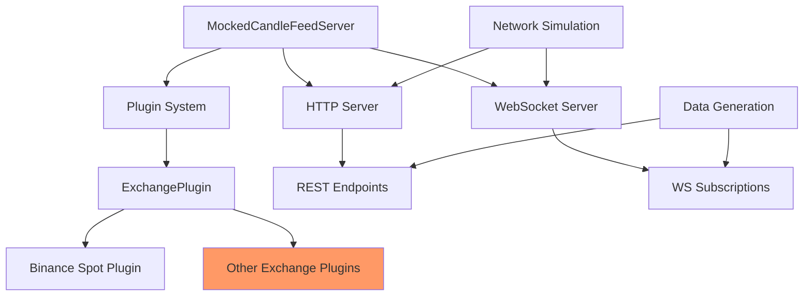

# Mock Server

The mock server component is a key part of the testing resources, providing a sophisticated simulation of exchange APIs for testing purposes. It enables you to test your code against a local server that behaves like a real exchange, without the need for internet connectivity or API keys.

## Overview



## Key Features

The mock server provides:

- **Complete API Simulation**: Realistic simulation of REST and WebSocket endpoints
- **Dynamic Data Generation**: Generates candle data with realistic price movements
- **Network Condition Simulation**: Simulate latency, packet loss, and server errors
- **Rate Limiting**: Configurable rate limits similar to real exchanges
- **Plugin System**: Extensible architecture for adding support for any exchange

## MockedCandleFeedServer

The `MockedCandleFeedServer` class is the main entry point for the mock server functionality:

```python
from mocking_resources.core.candle_feed_server import MockedCandleFeedServer
from mocking_resources.core import ExchangeType

# Create a mock server for Binance Spot
server = MockedCandleFeedServer(
    exchange_type=ExchangeType.BINANCE_SPOT,
    host="127.0.0.1",
    port=8080
)

# Configure with custom trading pairs
custom_pairs = [
    ("BTCUSDT", "1m", 50000.0),  # BTC with initial price of $50,000
    ("ETHUSDT", "1m", 3000.0),  # ETH with initial price of $3,000
]

# Start the server
await server.start(trading_pairs=custom_pairs)

# Use the server URL in your tests
server_url = server.url  # e.g., "http://127.0.0.1:8080"

# When done, stop the server
await server.stop()
```

## Network Conditions Simulation

One of the most powerful features of the mock server is the ability to simulate different network conditions:

```python
# Set challenging network conditions
server.set_network_conditions(
    latency_ms=200,        # 200ms latency
    packet_loss_rate=0.1,  # 10% packet loss
    error_rate=0.1         # 10% error responses
)

# Reset to normal conditions
server.set_network_conditions(
    latency_ms=0,
    packet_loss_rate=0.0,
    error_rate=0.0
)
```

## Rate Limiting

The mock server can simulate rate limiting behavior:

```python
# Set custom rate limits
server.set_rate_limits(
    rest_limit=120,       # 120 requests per minute
    rest_period_ms=60000, # 1-minute period
    ws_limit=5,           # 5 messages per second
    ws_burst=10           # Allow bursts of up to 10 messages
)
```

## Usage in Tests

### Integration Testing

```python
import pytest
from candles_feed.core.candles_feed import CandlesFeed

class TestCandlesFeedIntegration:
    @pytest.fixture
    async def mock_server(self):
        """Create a standalone mock server for testing."""
        server = MockedCandleFeedServer(
            exchange_type=ExchangeType.BINANCE_SPOT,
            host="127.0.0.1"
        )
        await server.start()
        yield server
        await server.stop()

    @pytest.mark.asyncio
    async def test_rest_strategy_integration(self, mock_server):
        """Test CandlesFeed with REST polling strategy."""
        # Create feed for testing
        feed = CandlesFeed(
            exchange="binance_spot",
            trading_pair="BTC-USDT",
            interval="1m"
        )
        
        # Override adapter REST URL to point to our mock server
        feed._adapter.get_rest_url = lambda: f"{mock_server.url}/api/v3/klines"
        
        try:
            # Start the feed with REST polling strategy
            await feed.start(strategy="polling")
            
            # Verify candles were retrieved
            candles = feed.get_candles()
            assert len(candles) > 0
        
        finally:
            # Stop the feed
            await feed.stop()
```

### Testing Error Handling

```python
@pytest.mark.asyncio
async def test_error_handling(mock_server):
    """Test system's response to network issues."""
    # Set error conditions
    mock_server.set_network_conditions(
        latency_ms=100,
        packet_loss_rate=0.2,
        error_rate=0.2
    )
    
    # Create feed and test
    feed = CandlesFeed(
        exchange="binance_spot",
        trading_pair="BTC-USDT",
        interval="1m"
    )
    
    # Override adapter URLs to point to our mock server
    feed._adapter.get_rest_url = lambda: f"{mock_server.url}/api/v3/klines"
    feed._adapter.get_ws_url = lambda: f"ws://{mock_server.host}:{mock_server.port}/ws"
    
    # Test with error conditions
    # ... (Your test code here)
    
    # Reset conditions for recovery testing
    mock_server.set_network_conditions(
        latency_ms=0,
        packet_loss_rate=0.0,
        error_rate=0.0
    )
    
    # Verify recovery
    # ... (Your verification code here)
```

## Adding Support for New Exchanges

To add support for a new exchange in the mock server, you need to create a plugin that implements the exchange's API behavior:

```python
from mocking_resources.core import ExchangePlugin
from mocking_resources.core import ExchangeType


class NewExchangePlugin(ExchangePlugin):
    def __init__(self, exchange_type: ExchangeType):
        super().__init__(exchange_type)

    @property
    def rest_routes(self):
        return {
            '/api/candles': ('GET', 'handle_klines'),
            # ... other routes
        }

    async def handle_klines(self, request):
        """Handle klines request for the new exchange."""
        # Parse request parameters
        # Generate response data
        # Return formatted response

    @property
    def ws_message_handlers(self):
        return {
            'subscribe': self.handle_subscribe,
            # ... other message types
        }

    async def handle_subscribe(self, websocket, message):
        """Handle subscription request for the new exchange."""
        # Parse subscription request
        # Set up subscription
        # Send confirmation
```

## Current Limitations

1. **Realistic Data Patterns**: While the mock server generates plausible price movements, they don't fully simulate real market behavior like volatility clustering or specific patterns.
2. **WebSocket Connection Limits**: The server does not currently enforce WebSocket connection limits per client.
3. **Advanced Authentication**: Only basic authentication schemes are implemented.

## Future Enhancements

1. More exchange plugins
2. Advanced market simulation models
3. Improved error simulation options
4. Recording and playback of real exchange data

## See Also

- [Mock Server Example](../examples/mock_server_example.md) - For practical examples of using the mock server