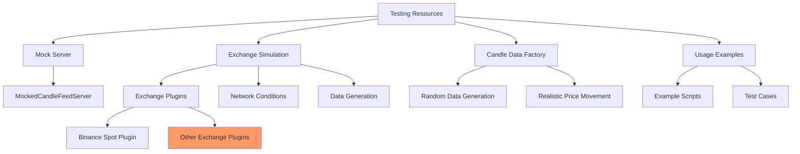

# Testing Resources Overview

The candles-feed package provides a comprehensive testing framework that enables thorough testing of exchange integrations without requiring access to real exchange APIs. This framework is particularly valuable for:

- **Unit Testing**: Testing adapter implementations without network dependencies
- **Integration Testing**: Testing the interaction between components
- **End-to-End Testing**: Testing complete workflows
- **Error Handling**: Testing system resilience under various error conditions

## Key Components

## Mock Server

The mock server component provides a complete simulation of exchange APIs, including:

- HTTP server for REST API endpoints
- WebSocket server for real-time data
- Rate limiting behavior similar to real exchanges
- Customizable error conditions

## Candle Data Factory

This component provides tools for generating realistic candle data:

- Random data generation with configurable parameters
- Price movement models based on real market behavior
- Time series generation with appropriate timestamps
- Custom data patterns for specific test scenarios

## Exchange Simulation

The exchange simulation framework provides:

- Realistic exchange behavior simulation
- Support for multiple exchange types through plugins
- Network condition simulation (latency, errors, etc.)
- Configurable market behavior

## Usage Examples

The testing resources include comprehensive examples demonstrating:

- Setting up mock servers for testing
- Generating and working with test data
- Writing effective tests using the framework
- Advanced testing scenarios

## Benefits for Users

1. **Reproducible Tests**: Create consistent test environments without external dependencies
2. **Faster Testing**: Run tests without network latency or rate limiting
3. **Complete Coverage**: Test error cases that are difficult to reproduce with real exchanges
4. **Development Without Exchange Access**: Develop and test exchange integrations without API keys

## Target Audience

This testing framework is designed for:

1. **Framework Maintainers**: For testing the core candles-feed components
2. **Adapter Developers**: For developing and testing new exchange adapters
3. **Client Application Developers**: For testing applications built with candles-feed

## Getting Started

To get started with the testing resources:

1. See the [Mock Server](mock_server.md) documentation for setting up a test server
2. Check out the [Examples](../examples/mock_server_example.md) section for practical demonstrations

Additional documentation will be added in future updates.