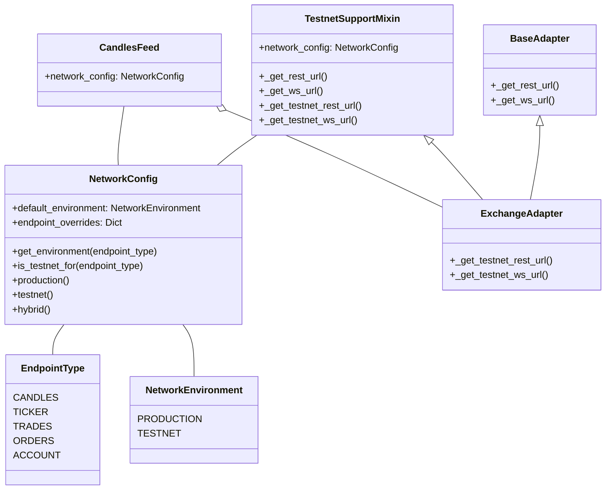

# Testnet Support

The candles-feed package supports connecting to exchange testnet environments. This feature allows developers to:

- Test code against exchange APIs without using real funds
- Verify integration with exchanges in a sandbox environment
- Support potential paper trading functionality

## Network Configuration System

The package uses a flexible network configuration system that allows different endpoint types to use different environments (production or testnet).

```python
from candles_feed import CandlesFeed
from candles_feed.core.network_config import NetworkConfig, NetworkEnvironment

# Full testnet configuration
feed = CandlesFeed(
    exchange="binance_spot",
    trading_pair="BTC-USDT",
    interval="1m",
    network_config=NetworkConfig.testnet()
)

# Hybrid configuration (production candles, testnet orders)
feed = CandlesFeed(
    exchange="binance_spot",
    trading_pair="BTC-USDT",
    interval="1m",
    network_config=NetworkConfig.hybrid(
        candles=NetworkEnvironment.PRODUCTION,
        orders=NetworkEnvironment.TESTNET
    )
)
```

## Architecture

The testnet support is implemented using a mixin-based approach that can be applied to any exchange adapter.



## Supported Exchanges

Currently, testnet support is implemented for:

- Binance Spot

Each exchange has different testnet capabilities and limitations. Check the exchange-specific documentation for details.

## Endpoint Types

The network configuration system supports the following endpoint types:

| Endpoint Type | Description |
|---------------|-------------|
| CANDLES       | Candle/kline data endpoints |
| TICKER        | Market ticker information |
| TRADES        | Trade history data |
| ORDERS        | Order placement and management |
| ACCOUNT       | Account information and balances |

## URL Mapping

The following testnet URLs are used for supported exchanges:

### Binance

| Environment | Protocol | URL |
|-------------|----------|-----|
| Production  | REST     | https://api.binance.com/api/v3 |
| Testnet     | REST     | https://testnet.binance.vision/api/v3 |
| Production  | WebSocket| wss://stream.binance.com:9443/ws |
| Testnet     | WebSocket| wss://testnet.binance.vision/ws |
